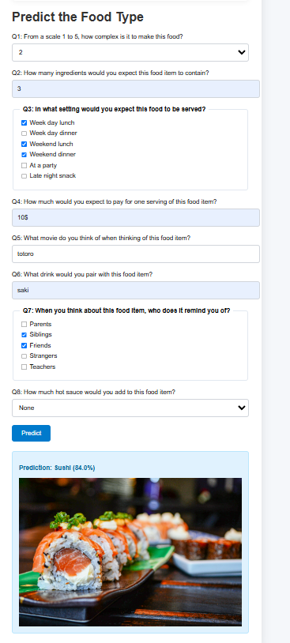

### Overview

This project was an exploration in data processing and developing a model in order to a label using numerical and textual features. A full overview of data processing methods and different models explored is available in the ```DATA_CLEANING.ipynb``` file

### Methodology

A user survey was conducted, where 500+ students answered three surveys, each time thinking of a different food item. The questions remained the same. Data was analyzed for correlation, and processed using various techinques (Simple string processing such as obtaining a single number from a range). BOW approach by using naiive bayes is applied to textual features to vectorie them, using a vocab dictionary. Finally, Logistic regression is applied with a softmax activation function in order to get a final output vector, where the largest value is returned as the highest probability guess

### SETUP INSTRUCTIONS:

-Navigate to https://t3chw1zrd.github.io/ML_PROJECT_PREDICT_FOOD/

-Think of a food (Shawarma, Sushi, Pizza)

-Answer the questions

-Did it get it right?


